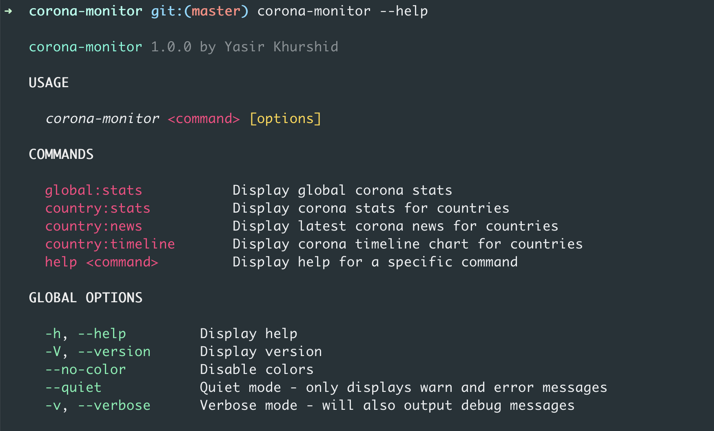
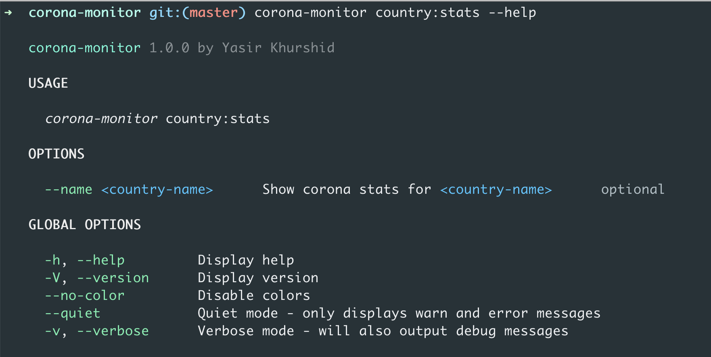
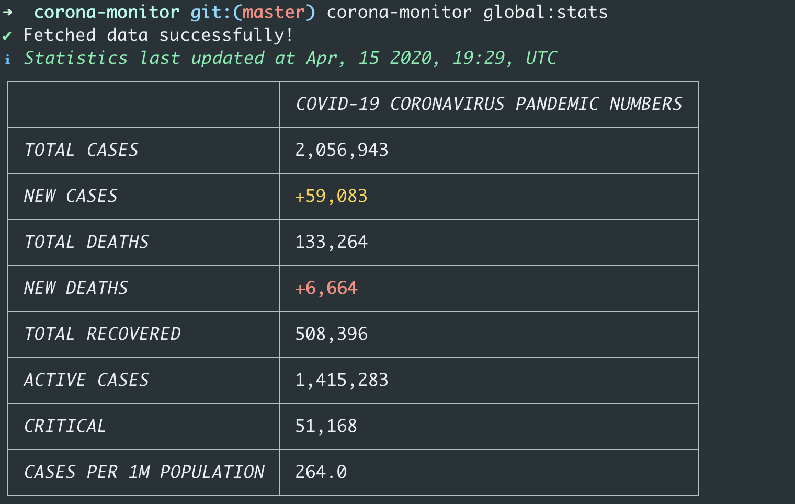
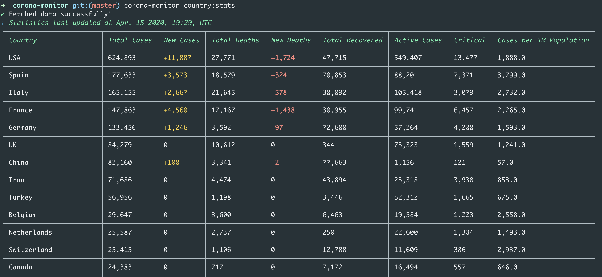
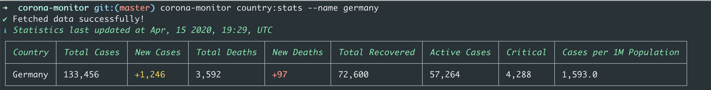
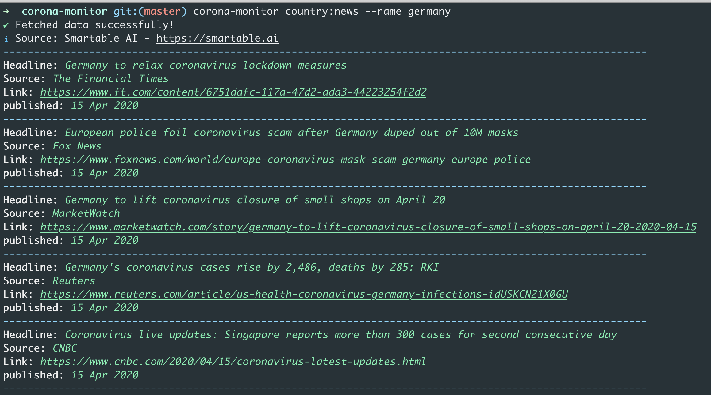
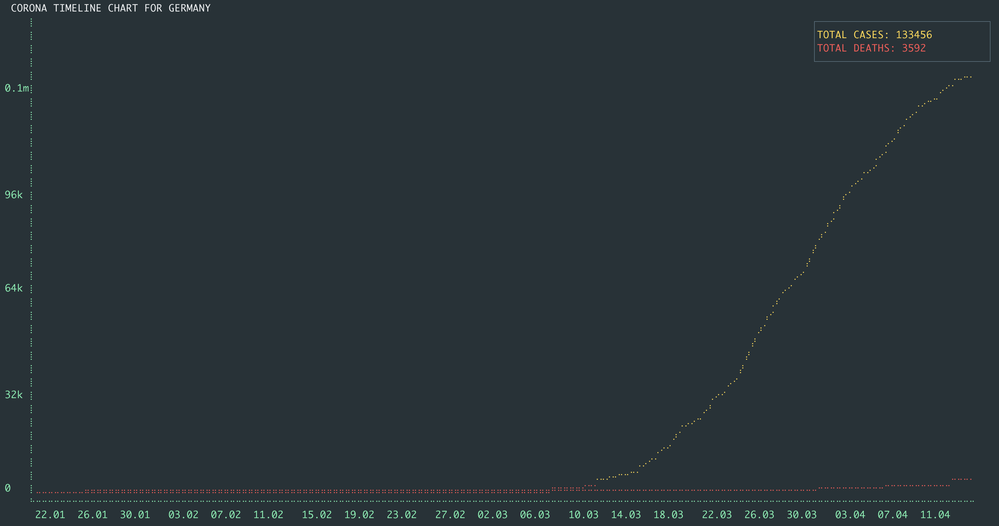

# corona-monitor 🦠

A Node.js CLI application for getting latest stats, news and history charts of corona (COVID-19)

* Get global corona (COVID-19) Statistics :earth_americas:
* Get all countries corona (COVID-19) Statistics :globe_with_meridians:
* Get corona (COVID-19) Statistics for a country :de:
* Get latest corona (COVID-19) news  for a country :newspaper:
* Get corona (COVID-19) timeline chart for a country :bar_chart:

## Installation

```
npm install -g corona-monitor
```

## Usage

### Getting help

```
corona-monitor --help
```



### Getting help for a command

```
corona-monitor country:stats --help
```



### Global stats

```
corona-monitor global:stats
```



### All countries stats

```
corona-monitor country:stats
```




### Single country stats

```
corona-monitor country:stats --name germany
```




### News for a country

```
corona-monitor country:news --name germany
```



### Timeline chart for a country


```
corona-monitor country:timeline --name germany
```



## License

MIT © Yasir Khurshid
